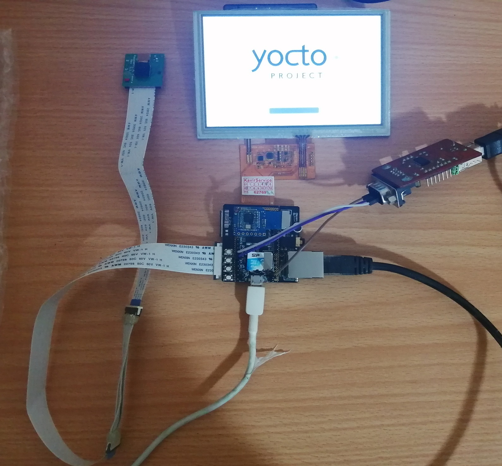

# Introduction
This is BPS layer for [LicheePi Zero Dock](https://licheepizero.us/) which enables most of it's media capabilities. Including:
1. video engine (`h.264` decoder)
1. display engine (with `800x480p` LCD)
1. mipi-csi2 (with `ov5640` camera)
1. audio codec

Also following items are active too
1. Ethernet (onboard 10/100Mbps LAN) with `dhcp`
1. WiFi (`rtl8723bs` SDIO module). Check `/etc/wap_supplicant/wpa_supplicant-nl80211-wlan0.conf`
1. USB otg (`host` mode)

Before using LicheePi-Zero-Dock mipi-csi2 interface, please check [v3s-mipi-csi2 repository](https://github.com/ArashEM/v3s-mipi-csi2). You need to do some hardware things!  



# Getting started
1. Clone required layers:
```bash
git clone git://git.yoctoproject.org/poky -b kirkstone
cd poky/
git clone https://github.com/linux-sunxi/meta-sunxi.git -b kirkstone
git clone https://github.com/openembedded/meta-openembedded.git -b kirkstone
git clone git@github.com:ArashEM/meta-licheepi-media.git -b kirkstone
cd ../
```
2. Export template configuration path and initialize build environment
```bash
export TEMPLATECONF=${TEMPLATECONF:-meta-licheepi-media/conf}
source poky/oe-init-build-env licheepi-zero-dock
```
3. Start build process
```bash
bitbake media-image
```
4. Flash `wic` image into your SD card (it must be `gunzip`ed first)
```bash
sudo dd if=tmp/deploy/images/licheepi-zero-dock/media-image-licheepi-zero-dock.wic of=/dev/sdX
```
5. Enjoy :-)

# GStreamer example
1. Turn backlight on 
```
echo 36 > /sys/class/gpio/export 
echo out > /sys/class/gpio/gpio36/direction 
echo 1 > /sys/class/gpio/gpio36/value
```

2. Configure media pipeline 
```
media-ctl -d /dev/sun6i-isp-media --set-v4l2 "'ov5647 0-0036':0[fmt:SBGGR10_1X10/640x480 field:none]"
media-ctl -d /dev/sun6i-isp-media --set-v4l2 "'sun6i-mipi-csi2':1[fmt:SBGGR10_1X10/640x480]"
media-ctl -d /dev/sun6i-isp-media --set-v4l2 "'sun6i-csi-bridge':1[fmt:SBGGR10_1X10/640x480]"
media-ctl -d /dev/sun6i-isp-media --set-v4l2 "'sun6i-isp-proc':1[fmt:SBGGR10_1X10/640x480]"
```
3. Configure camera for automatic gain, exposure and white balancing 
```
v4l2-ctl -d /dev/v4l-subdev3 --set-ctrl gain_automatic=1
v4l2-ctl -d /dev/v4l-subdev3 --set-ctrl auto_exposure=0
v4l2-ctl -d /dev/v4l-subdev3 --set-ctrl white_balance_automatic=1
```

4. Start a pipeline from camera to LCD (gray scale mode)
```
gst-launch-1.0 v4l2src device=/dev/sun6i-isp-capture num-buffers=200 ! video/x-raw,width=640,height=480,format=NV12 ! videoconvert ! video/x-raw,format=GRAY8 ! videoconvert ! fbdevsink sync=false
``` 
# Nots
1. You can configure your image before burning into SD card. for example setting `wpa-psk`.  
first check start sector of interested partition
```base
file media-image-licheepi-zero-dock.wic
media-image-licheepi-zero-dock.wic: DOS/MBR boot sector; partition 1 : ID=0xc, active, start-CHS (0x20,0,1), end-CHS (0x29f,3,32), startsector 4096, 81920 sectors; partition 2 : ID=0x83, start-CHS (0x2a0,0,1), end-CHS (0x3ff,3,32), startsector 86016, 1783808 sectors; partition 3 : ID=0x82, start-CHS (0x3ff,3,32), end-CHS (0x3ff,3,32), startsector 1871872, 204800 sectors
```
Then mount it via `offset` argument:
```bash
sudo mount -o rw,offset=$((512*86016)) file media-image-licheepi-zero-dock.wic /mnt/
```

2. `swap` partition is necessary! So consider using high speed SD card. Otherwise you may encounter issue using `GStreamer`.